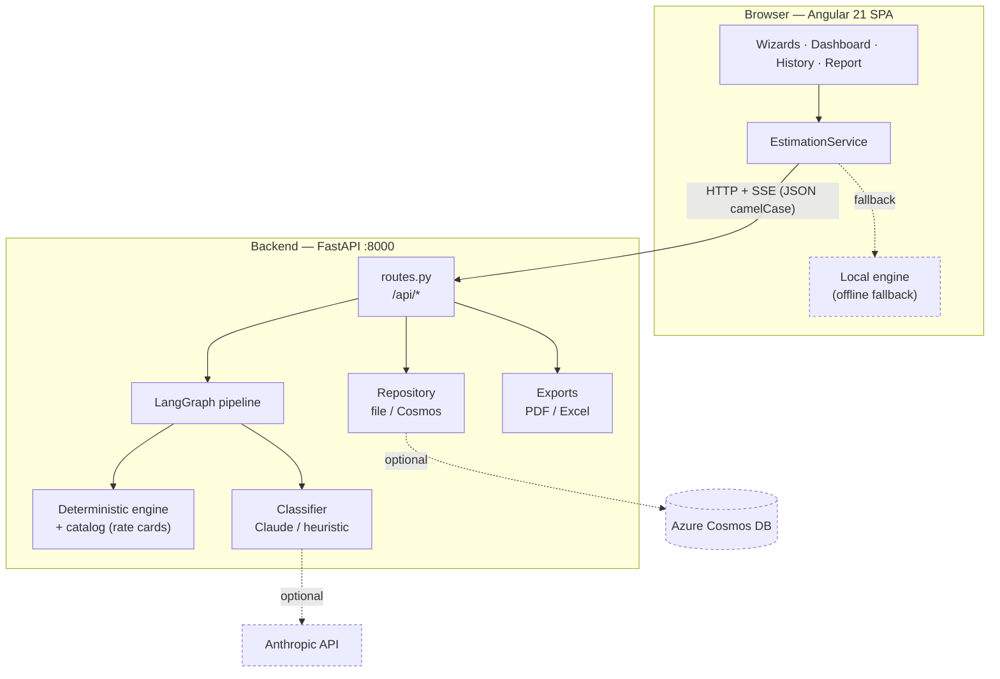
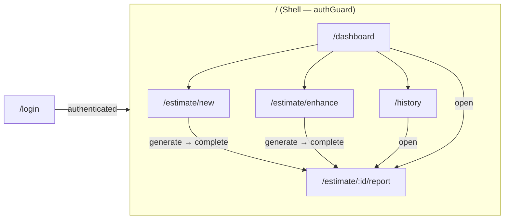
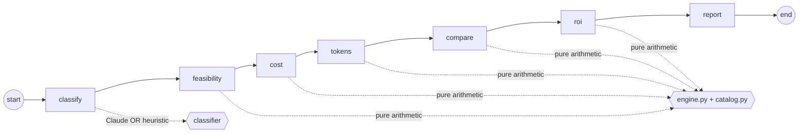
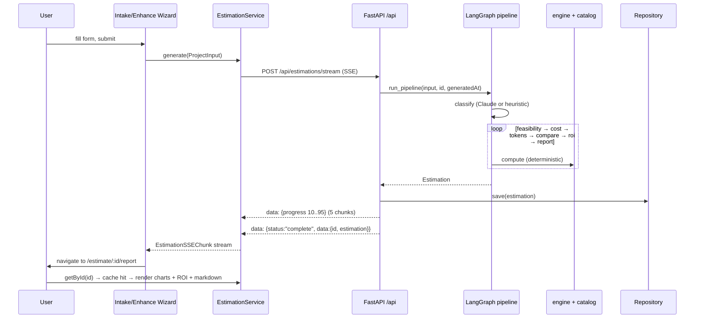

# CostCompass — Architecture

CostCompass is an enterprise decision-support platform that helps **leadership and
architects** decide *whether* to build with AI/GenAI/Agentic AI versus traditional
software, and *what it will cost*. It produces a feasibility score, an itemized cost
breakdown, an AI-vs-standard comparison, token-usage projections, and a deterministic
ROI model — for both greenfield ("new") projects and enhancements of an existing
codebase.

---

## 1. Design principles

| Principle | What it means here |
|---|---|
| **Deterministic costing** | The LLM **only classifies** fuzzy use cases into task types. **Code computes every dollar** from versioned rate cards and catalogs, so figures are reproducible and defensible in a budget review. |
| **JS ↔ Python parity** | The TypeScript in-browser engine and the Python backend engine produce **bit-identical** numbers (IEEE-754 doubles + `Math.round`-compatible rounding helpers). The backend is the source of truth; the browser engine is an offline fallback. |
| **Reproducible & auditable** | Same input → same output. Every estimation is persisted with its inputs and a generated-at timestamp. |
| **Graceful degradation** | Runs zero-config (keyword classifier + file persistence). Upgrades transparently when an Anthropic key and/or Cosmos DB are provided. If the backend is unreachable, the UI falls back to the local engine. |
| **Contract-first** | JSON crosses the wire in **camelCase** and matches the Angular TypeScript models byte-for-byte (Pydantic `to_camel` alias generator). |

---

## 2. Technology stack

**Frontend**
- Angular 21.2 — **zoneless**, **signals** (`signal`/`computed`/`toSignal`/`input`/`viewChild`/`effect`), **standalone** components, **OnPush**, lazy-loaded routes, control flow (`@if`/`@for`)
- chart.js 4.5 (cost doughnut + ROI line chart), marked 18 (markdown → HTML)
- Reactive forms, functional `HttpInterceptor` + `CanActivateFn` guard

**Backend**
- Python 3.13, FastAPI + uvicorn
- Pydantic v2 (camelCase wire contract via `to_camel`), pydantic-settings
- LangGraph `StateGraph` orchestration
- Anthropic SDK (classify node only, optional)
- reportlab (PDF), openpyxl (Excel)
- Repository pattern: file-backed default, lazy Azure Cosmos DB

---

## 3. High-level system diagram



> Only the `classify` node may call an LLM. Everything downstream is pure arithmetic,
> so the resulting estimation is fully reproducible.

---

## 4. Frontend architecture

### 4.1 Structure

```
src/app/
├── app.config.ts            # provideRouter, provideHttpClient(withInterceptors([apiInterceptor]))
├── app.routes.ts            # lazy routes, authGuard on the shell
├── core/
│   ├── guards/auth.guard.ts         # CanActivateFn → redirect to /login if unauthenticated
│   ├── interceptors/api.interceptor.ts  # adds x-correlation-id to first-party requests only
│   ├── models/                      # ProjectInput, Estimation, ROIProjection, dashboard, github
│   └── services/
│       ├── estimation.service.ts    # backend SSE + HTTP, local fallback engine, export URLs
│       ├── auth.service.ts          # session/identity
│       ├── mock-data.service.ts     # seeded dashboard/history rows + report synthesis
│       └── github-analyzer.service.ts  # repo fingerprinting for enhancement mode
├── features/
│   ├── login/                       # sign in
│   ├── shell/                       # app chrome (header + sidebar), router-outlet
│   ├── dashboard/                   # stats + recent estimates
│   ├── estimation/
│   │   ├── estimation.ts            # mode switch (new | enhancement)
│   │   ├── intake-wizard/           # new-build intake form → ProjectInput
│   │   └── enhance-wizard/          # existing-app intake (+ repo snapshot) → ProjectInput
│   ├── report/                      # the full estimation report (charts, ROI, markdown, exports)
│   └── history/                     # searchable list of estimates
└── shared/
    ├── components/
    │   ├── chart-canvas/            # signal-driven chart.js wrapper (effect rebuilds chart)
    │   ├── score-badge/  loading-spinner/  header/  sidebar-nav/
    └── utils/                       # feasibility labels, status helpers
```

### 4.2 Routing & navigation



All feature routes are **lazy `loadComponent`** chunks. The shell is protected by
`authGuard`; unauthenticated users are redirected to `/login`. Unknown paths redirect home.

### 4.3 `EstimationService` — the single data gateway

| Method | Behaviour |
|---|---|
| `generate(input)` | POSTs to `/api/estimations/stream`, parses the **SSE** byte stream (`fetch` + `ReadableStream` + `TextDecoder`, splitting on `\n\n`), emits one `EstimationSSEChunk` per node. On any network failure it **falls back** to `generateLocal()` (the in-browser deterministic engine). The final estimation is cached in an in-memory `Map`. |
| `getById(id)` | session cache → `GET /api/estimations/:id` → (last resort) synthesize a report from a seeded summary. |
| `list()` | `GET /api/estimations` (empty list if unreachable). |
| `pdfUrl(id)` / `excelUrl(id)` | Build the export download URLs the report links to. |

The browser also contains a full **mirror** of the deterministic engine
(`computeEstimation`, `scoreFeasibility`, `computeCost`, …) used only when the API is
down — guaranteeing the app is usable offline and demonstrating parity.

### 4.4 Report rendering

The `Report` component is signal-driven:

- `estimation = toSignal(route.paramMap → estimationSvc.getById(id))`
  (`undefined` = loading, `null` = not found, object = loaded)
- `costChart` / `roiChart` — `computed<ChartConfiguration>` fed into the reusable
  `<app-chart-canvas>` (dark-mode palette; chart.js `registerables` registered once)
- `renderedReport` — `marked.parse(reportMarkdown)` bound via `[innerHTML]`
- Export buttons are anchors bound to `pdfHref(id)` / `excelHref(id)`

---

## 5. Backend architecture

### 5.1 Layered modules

```
backend/app/
├── main.py         # FastAPI app, CORS, router include, "/" banner
├── routes.py       # APIRouter(prefix="/api") — all HTTP endpoints
├── schemas.py      # Pydantic v2 models, camelCase aliases (CamelModel base)
├── pipeline.py     # LangGraph StateGraph: classify→…→report ; SSE_STEPS ; run_pipeline()
├── engine.py       # deterministic engine — every number is computed here
├── classifier.py   # Claude classification + keyword heuristic fallback
├── catalog.py      # rate cards, model pricing, task profiles, scale tiers (the "knobs")
├── repository.py   # EstimationRepository ABC + FileRepository + CosmosRepository
├── exports.py      # estimation_to_pdf (reportlab) / estimation_to_excel (openpyxl)
└── config.py       # pydantic-settings; llm_enabled / cosmos_enabled / cors_origin_list
```

### 5.2 The LangGraph pipeline



- **classify** — the *only* node that may call an LLM. Fills in any missing/invalid
  `taskType` on a use case. Uses Claude when `enable_llm_classifier` **and** an API key
  are present; otherwise priority-ordered keyword rules
  (e.g. "detect fraud" → `anomaly_detection`, "summarize" → `summarization`).
- **feasibility** — sub-scores (AI necessity / agentic / traditional suitability),
  composite score + rating, recommendation **archetype** (traditional → multi-agent),
  per-use-case analysis, risks, opportunities.
- **cost** — development effort (feature complexity hours + AI-integration + enhancement
  integration), Azure infrastructure line items, token cost, maintenance, and a
  min/expected/max first-year total.
- **tokens** — daily/monthly/annual token volume scenarios + per-use-case model picks.
- **compare** — AI vs standard build: cost, timeline, team size, dimension scoring (0–10),
  and a recommendation (`ai` / `standard` / `hybrid`).
- **roi** — deterministic benefit = automated calls × per-task-type value; payback months,
  3-year value, ROI %, and a 13-point cumulative-net curve (months 0,3,…,36).
- **report** — assembles the `Estimation`, composes the markdown summary, attaches the
  enhancement-mode repo snapshot.

The graph is compiled once at import (`_GRAPH`) and is stateless across invocations.

### 5.3 Determinism & parity helpers (`engine.py`)

JavaScript `Math.round` is half-up; Python's built-in `round` is banker's rounding. To
reproduce the TS engine exactly the backend uses:

```python
jround(n) = floor(n + 0.5)          # JS Math.round (half-up)
round2(n) = floor(n*100 + 0.5)/100  # 2-dp half-up
clamp(n, lo=0, hi=100)
```

Same operation order + IEEE-754 doubles ⇒ identical results in both engines. This is
verified by `backend/smoke_test.py`, which runs the full pipeline against a fixed
fixture and asserts hand-computed values (feasibility, costs, token cost, totals, ROI,
exports, enhancement line items).

### 5.4 Persistence & exports

- **Repository** — `get_repository()` returns a singleton: `CosmosRepository` when
  `COSMOS_ENDPOINT` + `COSMOS_KEY` are set and the SDK imports, otherwise
  `FileRepository` (JSON under `.data/`, in-memory cache, thread-locked writes).
- **Exports** — server-rendered **PDF** (reportlab) and **Excel** (openpyxl, 5 sheets:
  Summary, Cost Breakdown, Tokens, ROI, Recommendations), streamed with
  `Content-Disposition: attachment; filename="<slug>-costcompass.<ext>"`.

---

## 6. End-to-end flow: generating an estimate (streaming)



If the backend is unreachable at the `POST` step, `generate()` transparently switches to
`generateLocal()` and the same chunk sequence is produced in the browser.

---

## 7. API reference

Base URL `http://localhost:8000` · business routes under `/api` · all bodies JSON **camelCase**.

### Meta
| Method | Path | Purpose | Response |
|---|---|---|---|
| `GET` | `/` | Service banner | `{ name, version, docs:"/docs" }` |
| `GET` | `/api/health` | Liveness + mode flags | `{ status, version, llmClassifier, persistence }` |
| `GET` | `/docs` | Swagger UI (auto) | OpenAPI |

### Estimations
| Method | Path | Body | Response | Notes |
|---|---|---|---|---|
| `POST` | `/api/estimations` | `ProjectInput` | `Estimation` | Synchronous compute + persist |
| `POST` | `/api/estimations/stream` | `ProjectInput` | `text/event-stream` | 5 progress chunks + 1 final `complete` chunk |
| `GET` | `/api/estimations` | — | `Estimation[]` | List all |
| `GET` | `/api/estimations/{id}` | — | `Estimation` / `404` | Fetch one |
| `GET` | `/api/estimations/{id}/export/pdf` | — | `application/pdf` | Attachment |
| `GET` | `/api/estimations/{id}/export/excel` | — | `…spreadsheetml.sheet` | Attachment |

**SSE chunk** (`EstimationSSEChunk`):
```jsonc
{ "node": "feasibility", "status": "processing", "content": "…", "progress": 35, "data": null }
// final:
{ "node": "report", "status": "complete", "progress": 100,
  "data": { "id": "est_…", "estimation": { /* full Estimation */ } } }
```

---

## 8. Core data contracts

**`ProjectInput`** (request)
```jsonc
{
  "projectName", "projectType": "new|enhancement", "description",
  "industryDomain", "targetUsers", "scale": "small|medium|large|enterprise",
  "features": [{ "id","name","description","complexity":"low|medium|high|very_high","aiCandidate":bool }],
  "aiUseCases": [{ "id","name","taskType?","description",
                   "priority":"must_have|nice_to_have|exploratory","linkedFeatureIds":[] }],
  "technicalPreferences": { "preferredLLMProvider","deploymentModel":"cloud|hybrid|edge",
                            "existingInfra","complianceRequirements":[],"budgetCeiling?","budgetCurrency" },
  "volumeAndScale": { "expectedDailyUsers","requestsPerDay","dataVolumeGB",
                      "peakLoadPattern","growthRatePercent" },
  // enhancement-only:
  "repoUrl?","repoBranch?","currentArchitecture?","enhancementScope?","integrationConstraints?",
  "repoFullName?","repoStars?","repoFileCount?","repoManifests?","repoTopics?"
}
```
> `taskType` is optional — the `classify` node fills it when blank.

**`Estimation`** (response)
```jsonc
{
  "id","projectId","projectName","projectType","industryDomain",
  "feasibility": { "score","rating",
                   "subScores": { "aiNecessity","agenticSuitability","traditionalSuitability" },
                   "archetype","archetypeLabel","archetypeRationale","rationale",
                   "useCaseAnalysis":[],"risks":[],"opportunities":[] },
  "costBreakdown": { "development","infrastructure": { "services":[] },
                     "aiTokens": { "modelBreakdown":[] },
                     "maintenance","total": { "min","expected","max" }, "currency" },
  "tokenProjection": { "daily","monthly","annual","modelRecommendations":[],"assumptions":[] },
  "comparison": { "aiApproach","standardApproach","summary",
                  "recommendation":"ai|standard|hybrid","dimensions":[] },
  "roiProjection": { "annualBenefit","annualRunCost","developmentCost","netAnnualBenefit",
                     "paybackMonths|null","threeYearValue","roiPercent",
                     "curve":[],"valueDrivers":[],"assumptions":[] },
  "recommendations": [{ "priority","category","title","description","estimatedImpact" }],
  "reportMarkdown","status","generatedAt",
  "repoContext?": { "fullName","htmlUrl","branch","primaryLanguage","stars",
                    "fileCount","architecture","manifestsFound":[],"topics":[] }
}
```

---

## 9. Configuration

All settings are environment-driven with safe local defaults (`backend/app/config.py`,
read from `.env`):

| Setting | Default | Effect |
|---|---|---|
| `ENABLE_LLM_CLASSIFIER` | `true` | Allow the classify node to call Claude (needs a key too) |
| `ANTHROPIC_API_KEY` | — | Enables real LLM classification; absent ⇒ keyword heuristic |
| `CLASSIFIER_MODEL` | `claude-3-5-haiku-latest` | Model used by the classify node |
| `DATA_DIR` | `./.data` | File-repository storage location |
| `COSMOS_ENDPOINT` / `COSMOS_KEY` | — | Switches persistence to Azure Cosmos DB |
| `CORS_ORIGINS` | `http://localhost:4200,http://127.0.0.1:4200` | Allowed browser origins |

`llm_enabled = ENABLE_LLM_CLASSIFIER && ANTHROPIC_API_KEY`,
`cosmos_enabled = COSMOS_ENDPOINT && COSMOS_KEY`.

The frontend reads `environment.ts` (dev `apiUrl = http://localhost:8000/api`) /
`environment.prod.ts` (`apiUrl = /api`).

---

## 10. Running locally

```bash
# Backend (zero-config: heuristic classifier + file persistence)
cd backend
python -m venv .venv && source .venv/bin/activate
pip install -r requirements.txt
uvicorn app.main:app --reload --port 8000
python smoke_test.py            # parity & sanity check (no server needed)

# Frontend
npm install
npm start                       # ng serve on http://localhost:4200
```

---

## 11. Known gaps / roadmap

These do not block current use but matter for broad enterprise rollout:

- **AuthN/AuthZ** — the API has no real auth/RBAC yet (the UI has a placeholder identity
  and a route guard). Leadership cost/ROI data typically needs SSO + role gating.
- **Assumption transparency** — rate cards, model pricing, and scale tiers live in
  `catalog.py`. Surfacing/overriding them per organization would increase trust in the
  numbers.
- **Audit & versioning** — persist *who* generated an estimate and lock snapshots for
  governance.
- **Shared persistence** — make Cosmos the default in multi-user deployments; wire the
  dashboard/history views to the backend `list()` endpoint.
```
